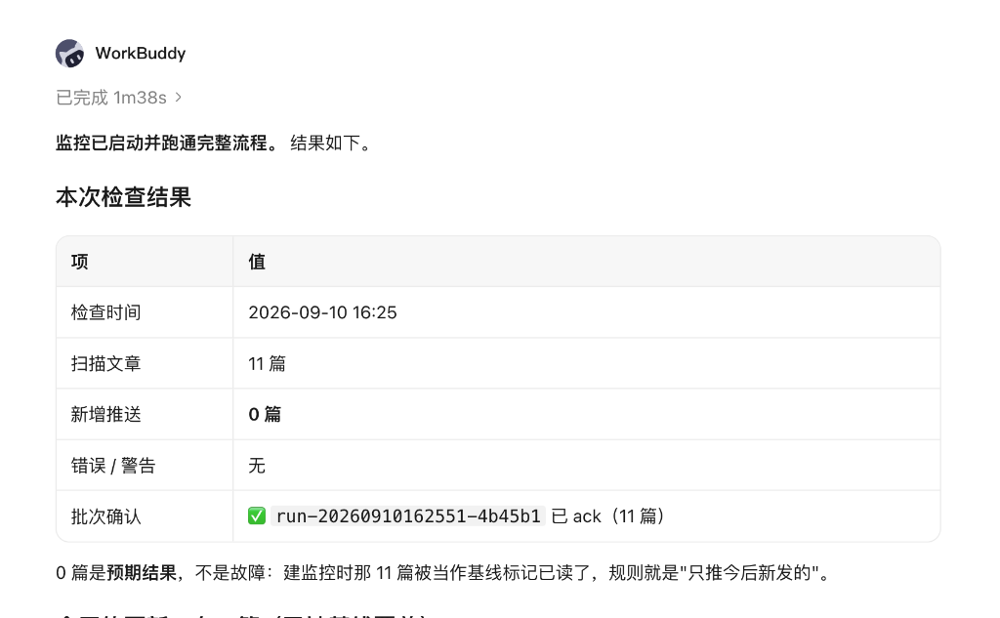
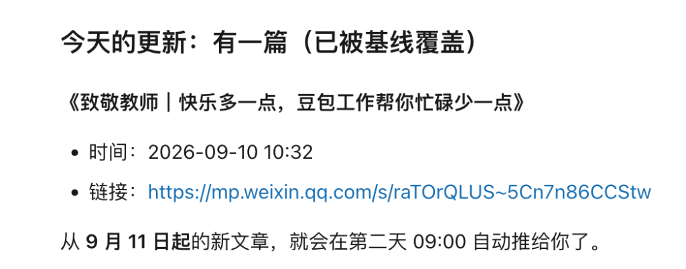

<h1 align="center">weread-mp-monitor</h1>

<p align="center">基于微信读书订阅的微信公众号增量监控与精准推送工具，支持独立 CLI 与 Agent Skill 自动化调度。</p>

<p align="center">
  <a href="./LICENSE"></a>
  
  
</p>

weread-mp-monitor 是一个面向微信公众号的静默增量监控工具。它通过读取您在微信读书移动端关注的公众号书架数据，自动追踪文章更新，结合初次基线对齐、标题/全文关键词过滤与两阶段确认机制，确保只向您推送真正关心的最新文章，杜绝历史文章轰炸与推送丢失。

本项目既可以作为独立的 Python 命令行工具手工或定时调用，也可以作为 Agent Skill（配合 ChatGPT Automations、Claude Code 等）作为智能化自动化工作流的执行核心。

## 核心亮点

| 亮点 | 对使用者的价值 |
|---|---|
| **首期基线防轰炸** | 添加公众号时自动将现有文章标记为已读基线，避免首次接入时历史文章全量误推送 |
| **零抓包扫码登录** | 无需打开浏览器开发者工具抓取 Cookie，扫码后自动从本地 Chromium 浏览器安全提取会话 |
| **两阶段安全交付** | 支持检查与确认解耦流程（`--defer-ack`），通知推送成功后再提交确认，防止进程异常吞漏更新 |
| **多维关键词过滤** | 支持任一命中（any）与全部命中（all）逻辑，支持可选的正文穿透匹配，过滤不改变已读状态 |
| **并发安全与无凭据泄漏** | 状态文件受排他文件锁与原子写入保护，CLI 绝不暴露 `--cookie` 参数，防止历史命令泄露凭据 |
| **纯标准库与离线保障** | 核心监控逻辑仅依赖 Python 3.9+ 标准库，内置 87 项离线单测，无外部重型运行时依赖 |

## 系统架构

```text
┌─────────────────────────────────────────────────────────────┐
│                 宿主 / 自动化调度层 (Host)                   │
│      (ChatGPT Automations / Claude Code / cron / launchd)    │
└──────────────────────────────┬──────────────────────────────┘
                               │  CLI Arguments (--json)
                               ▼
┌─────────────────────────────────────────────────────────────┐
│              weread-mp-monitor 控制平面                      │
│    (SKILL.md Agent 编排 / scripts/weread_monitor.py CLI)    │
└──────────────┬──────────────────────────────┬───────────────┘
               │                              │
     读取会话 (browser-cookie3)       原子写入 + flock 排他锁
               ▼                              ▼
┌──────────────────────────────┐┌─────────────────────────────┐
│       本地浏览器配置环境       ││        持久化状态存储        │
│  (Chrome / Edge / Brave /    ││  (~/.weread_mp_monitor_     │
│   Chromium 个人资料会话)      ││   state.json, 0600 权限)   │
└──────────────┬───────────────┘└─────────────────────────────┘
               │
      已鉴权 HTTPS 请求
               ▼
┌──────────────────────────────┐     公开 HTTPS 请求    ┌─────────────────────────────┐
│       微信读书 Web 接口       │──────────────────────▶│     微信公众平台文章页面     │
│ (获取已关注列表 / 文章元数据)  │     抓取文章正文      │ (mp.weixin.qq.com HTML/正文)│
└──────────────────────────────┘                       └─────────────────────────────┘
```

## 使用示例

以下展示以监控“豆包”公众号为例的完整流程。配合智能助手（如 WorkBuddy、ChatGPT、Claude Code 等）执行定时检查时的实际交互过程：

<p align="center">
  
</p>

1. **自动执行与基线生效**：调度器在执行 `check --with-body --defer-ack` 后扫描到了 11 篇已有文章。由于添加监控时已自动建立基线，系统识别这 11 篇为历史文章并自动覆盖标记，新增推送为 0 篇，杜绝了初次添加监控时的信息过载。
2. **批次状态提交 (ack)**：本次检查生成的批次标识（如 `run-20260910162551-4b45b1`）在确认后提交 ack，保证状态被安全保存。

<p align="center">
  
</p>

3. **透明清晰的更新追踪**：即便属于基线覆盖的文章，检查过程依然清晰记录发布时间与微信公众号原始文章链接，并明确约定次日定时任务开始仅向用户推送真正新发布的增量内容。

## 快速安装

本项目核心脚本仅需 Python 3.9 或更高版本标准库。

```bash
# 克隆仓库
git clone https://github.com/245678000000/weread-mp-monitor-skill.git
cd weread-mp-monitor-skill

# 可选：安装 browser-cookie3 以支持扫码后自动从浏览器提取登录态
python3 -m pip install browser-cookie3
```

前置准备：
- 请确保待监控的公众号已在**微信读书手机 App**中添加关注（仅在微信中关注无效）。
- 本地安装有 Chrome、Edge、Brave 或 Chromium 浏览器。

## 快速开始

在终端中执行以下验证流程：

```bash
# 设置脚本命令别名
MONITOR="python3 $PWD/scripts/weread_monitor.py"

# 1. 扫码登录：自动打开微信读书网页，使用微信扫码完成鉴权
$MONITOR --json login

# 2. 环境体检：检查登录态有效性与当前关注的公众号数量
$MONITOR --json doctor

# 3. 查看已关注公众号列表
$MONITOR --json accounts

# 4. 添加监控：添加“豆包”公众号（默认将近 20 篇文章计入基线，防止历史回溯）
$MONITOR --json add "豆包"

# 5. 检查更新并获取文章正文
$MONITOR --json check --with-body

# 6. 查看当前监控配置清单
$MONITOR --json list

# 7. 移除监控
$MONITOR --json remove "豆包"
```

## 命令与选项一览

| 命令 | 用途与参数说明 |
|---|---|
| `login` | 打开微信读书网页并等待扫码，自动获取浏览器会话。选项：`--save <PATH>`、`--browser <NAME>`、`--no-open`、`--timeout <SEC>` |
| `doctor` | 检查登录凭据有效性，统计并返回当前已关注的公众号数量 |
| `accounts` | 列出微信读书中已关注的所有微信公众号名称与元信息 |
| `add <name>` | 添加或更新监控。选项：`--keyword`（覆盖设置）、`--add-keyword`（追加）、`--clear-keywords`（清空）、`--match-mode any|all`、`--match-body`、`--baseline N`、`--reset-baseline` |
| `list` | 查看已配置的监控公众号列表、过滤规则及最近检查时间 |
| `remove <name>` | 移除指定公众号的监控，并返回剩余监控数量 `remaining` |
| `check [name]` | 执行增量检查。选项：`--limit <N>`、`--with-body`、`--body-chars <N>`、`--defer-ack`、`--no-mark`（仅预览不写状态） |
| `ack <batch_id>` | 提交指定批次的已读确认。选项：`--all`（确认所有待提交批次） |

所有命令均支持 `--json` 标志。在传递 `--json` 时，无论执行成功还是失败，均保证输出结构化 JSON 对象。

退出状态码规范：
- `0`：正常完成
- `1`：一般性错误
- `2`：微信读书登录态过期（`auth_expired`）
- `3`：目标公众号或待确认批次未找到 / 匹配存在歧义
- `4`：状态文件不可读或损坏

## 进阶特性

### 关键词过滤机制

```bash
# 任一关键词命中即推送（默认 any 模式）
$MONITOR --json add "豆包" --keyword Agent --keyword 编程

# 全部关键词必须同时命中（all 模式）
$MONITOR --json add "豆包" --keyword Agent --keyword 编程 --match-mode all

# 启用正文内容匹配（默认仅匹配标题和摘要）
$MONITOR --json add "豆包" --keyword Agent --match-body

# 保留现有关键词，追加新关键词
$MONITOR --json add "豆包" --add-keyword RAG

# 清空所有关键词过滤，推送该账号所有新文章
$MONITOR --json add "豆包" --clear-keywords
```

注意：每篇被扫描到的文章无论是否命中关键词，都会被标记为已扫描。因此后续即便放宽过滤条件，也不会对历史旧文章进行重复推送。

### 两阶段安全交付（Scheduled Flow）

在自动化定时任务中，推荐使用延迟确认流程，防止因通知发送失败或网络波动导致文章被漏读：

```bash
# 1. 检查更新，暂不标记已读，获取 batch_id
RESULT=$($MONITOR --json check --with-body --defer-ack)
BATCH_ID=$(echo "$RESULT" | python3 -c 'import json,sys; print(json.load(sys.stdin).get("batch_id",""))')

# 2. 宿主程序执行推送通知（推送标题、摘要、正文提炼等）
# ...

# 3. 推送成功后，提交确认标记
if [ -n "$BATCH_ID" ]; then
  $MONITOR --json ack "$BATCH_ID"
fi
```

如果未执行 `ack`，未确认批次的文章在下次检查时将重新被纳入，确保文章必达。

### 认证机制与安全说明

- **扫码自动读取**：执行 `login` 时自动拉起浏览器，微信扫码完成后通过 `browser-cookie3` 读取会话数据，无需在控制台暴露敏感网络请求。
- **持久化凭据支持**：在定时任务等无人值守环境中，可使用 `login --save ~/.weread.cookie` 将会话导出为 `0600` 权限的受保护文件，并通过环境变量 `WEREAD_COOKIE_FILE` 指向该文件。
- **登录态查找顺序**：
  1. 环境变量 `WEREAD_COOKIE_FILE`（或命令行 `--cookie-file`）
  2. 环境变量 `WEREAD_COOKIE`
  3. 本地 Chromium 浏览器自动提取
- **无 `--cookie` 命令行入参**：程序刻意不提供接收 Cookie 明文的命令行参数，杜绝凭据泄露至系统进程列表（`ps`）和终端命令历史记录中。

## 状态存储与并发保护

状态默认存储于 `~/.weread_mp_monitor_state.json`，或通过环境变量 `WEREAD_MONITOR_STATE` 指定自定义路径。
- 该文件仅保存公众号监控配置、已读文章 ID 索引与待确认批次，**绝不记录 Cookie 凭据**。
- 写入时采用临时文件原子替换（atomic rename），并在读取和修改全流程应用排他文件锁（`flock`），保证多进程或并发调度下的数据一致性。

## 相关文档与参考

| 主题 | 内容说明 | 文档链接 |
|---|---|---|
| **自动化集成** | 涵盖 ChatGPT Automations、Claude Code 与 Linux cron/launchd 的配置指引 | [查看自动化配置指南](./references/automation.md) |
| **部署与网络设置** | 本地配置、远程伴侣服务（`weread_monitor_service.py`）部署及限制 | [查看部署说明文档](./references/setup.md) |
| **数据源与限制说明** | 接口性质、调用频次边界及正文抓取降级说明 | [查看限制与说明文档](./references/source-and-limits.md) |

## 限制与注意事项

1. **接口性质**：微信读书接口为非公开内部协议，可能会随官方调整发生变更。如遇到非 JSON 响应，请排查接口变动。
2. **频率控制**：建议采用每日一次的检查频次，本项目不适用于高并发或批量爬虫场景。
3. **正文降级**：微信公众号正文抓取独立于列表获取。若文章发生风控拦截或失效，系统会自动将 `body_status` 置为非 `ok` 状态，并降级返回列表摘要。

## 测试套件

项目内置完备的离线单元测试，无需网络连接或真实微信读书账号：

```bash
python3 -m unittest discover -s tests -v
```

## Star 历史

[](https://star-history.com/#245678000000/weread-mp-monitor-skill&Date)

## 许可证

本项目基于 [MIT 许可证](./LICENSE) 开源。

核心思路与微信读书交互机制启发自 MIT 开源项目 [steptian/weread-mp](https://github.com/steptian/weread-mp)。
